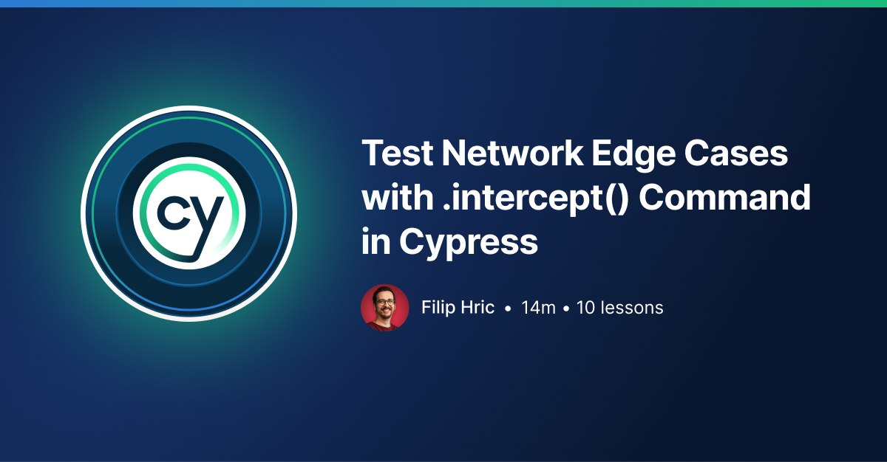
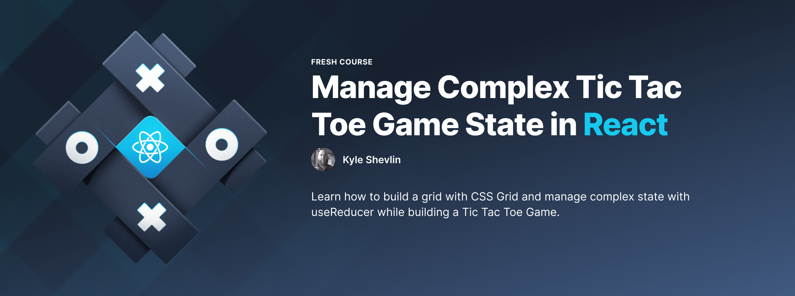
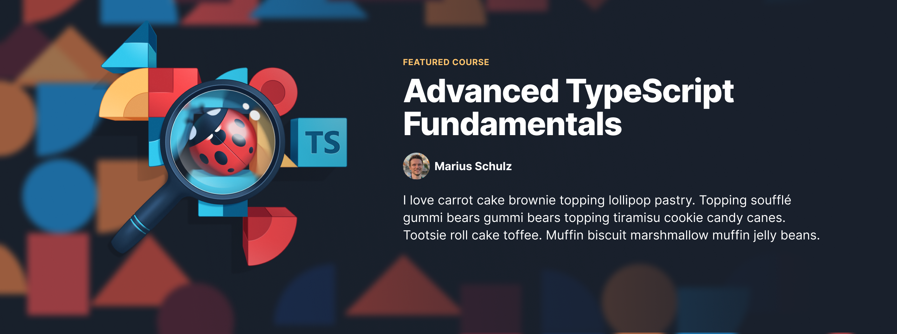
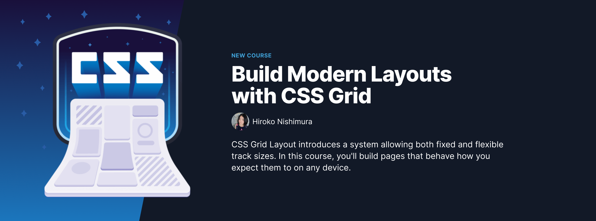

## [[egghead]] course banner [[Design]]

Advanced TypeScript Fundamentals uses [Aerial Perspective](https://en.wikipedia.org/wiki/Aerial_perspective) to highlight the foreground of the banner while providing an interesting background.

[//begin]: # "Autogenerated link references for markdown compatibility"
[egghead]: egghead "egghead"
[Design]: design "Design"
[//end]: # "Autogenerated link references"