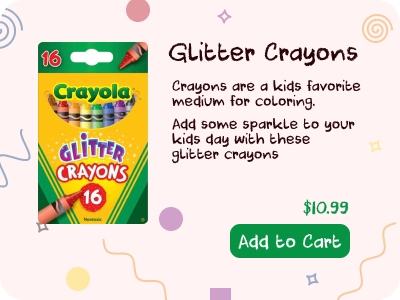
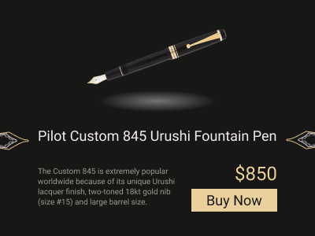

Design direction is the combination of Art Direction and the fundamentals of good UI design.

The design direction you choose gives you the ability to start to define what feels right for a project.

For any given project, your design direction should answer the following questions:

- How does it feel?
- Why does it feel that way?
- What do you wan tit to look like?

There are a lot of adjectives that you can use to describe your project. Starting with those and playing with your design until you feel the magic is a great approach for direction.

e.g. sharp, corporate, modern, 'start up'-y, clean, crisp, impactful, colorful

This process can take days, weeks, or months for a project. Give it time and keep playing with the direction and implementation.

## Exercise

I designed two cards that are supposed to encapsulate design direction. Both 'buy' cards for a product: Crayons and fountain pens.

### Crayon
This is supposed to be: fun, playful, friendly, happy

This card felt easier to design to me. Round corners, a font that is 'crayon'-y, and a colorful background with shapes that are something you might draw with crayons.

### Fountain Pen

This is supposed to be: Sharp, elegant, premium, classy

This one was hard for me to design. I don't think I nailed it but was spending too much time on it. I wanted a minimal design with harder edges. The pen should be the focus so I added a shadow to that and the color scheme made sense to match the pen.

Spent way too much time tracing the pens tip to make the svg so I kept it in there but don't know if that really works.

