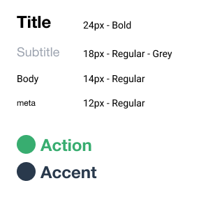

An article inspired while working on 
[[Vue Fundamentals Portfolio Project Design Assets]]

## Intro
[[Vue Fundamentals]] is a course that [[Kevin Cunningham]]is producing that I am advising him on. Part of that process is developing a [[Portfolio Project]] that learners can complete that will prove to themselves and others that they understand Vue at a fundamental level.

Kevin made [a Vue starter app](https://github.com/doingandlearning/vue-fundamentals-challenge) that will serve up the data needed for the challenge.

## Design Product Cards
The project involves a hardware store that needs an index of product cards displayed with relevant information.

It needed designs which is where I contribute. I started with the product card.

Here's V1: 

This looks alright. I started with the [[typography]] and designated the font sizes that I would use for the design. Consistent [[font size]] is key. 

The most significant aspects of the card are the price and the action for people to buy. Everything else falls around these two elements.

A big flaw in this design is the use of negative space throughout the card. Just like with Typography, negative space and spacing should consistent in your application.

You might not notice that there are quite a few different spacings going on but over-all it combines into a sloppy looking card where 'something is off.'

When the spacing is highlighted, you can see really well that the spacing in the card is sloppy. Nothing is consistent and this results in the card looking off.

This is where [[implicit grid]] helps. The changes are subtle but the consistency in spacing has a large impact on the overall presentation of an element.

This becomes more and more impactful when you multiple this design across your whole site.

Here you can see the explicit pixel spacings applied to the card:

You'll notice that not everything is exactly lined up using the grid. This is because you need to zoom out and look at the over all design to see if it's working and what isn't given your constraints.

The [[implicit grid]] gives you a starting point to stay consistent across elements. In this case you can see that elements that are closely related are given 12px space in-between. This type of decision can be carried out throughout the site.

What do you like or don't like about this design? What would you change?