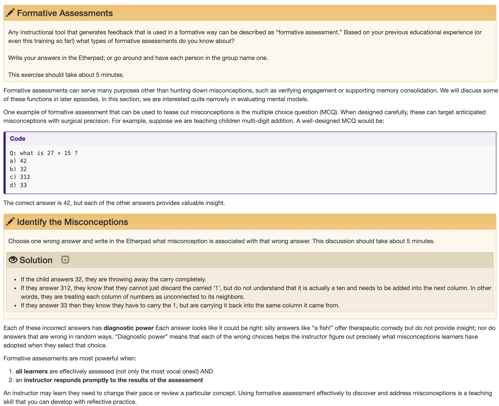

[link](https://carpentries.github.io/instructor-training/02-practice-learning/index.html#using-formative-assessment-to-identify-misconceptions)

Show how a learner is either getting it or where they went wrong. The answer provided to the assessment shows how someone is understanding a mental model needed to complete the assessment.

