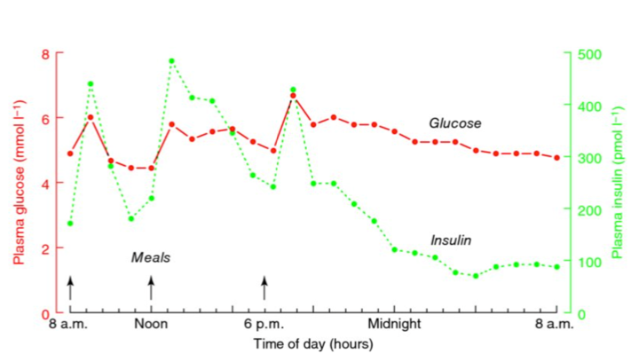
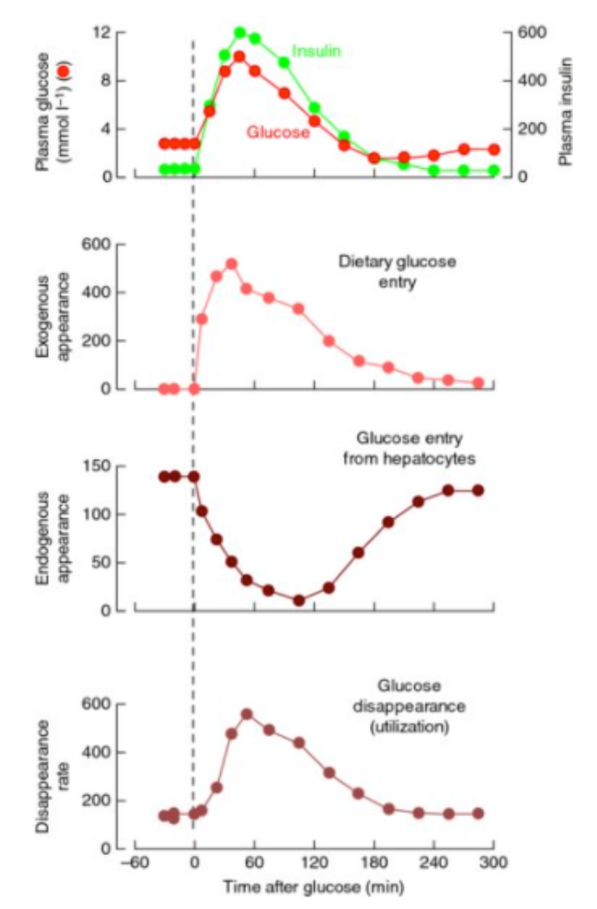

## Intro
In this lecture we begin to put all of what we've learned into the context of daily life. We first explore how the body operates in the fasted state, basically having just woken up from a full 8 hour sleep. We explore which macronutrients are being used to fuel various biological processes. From there, we think about what happens after we eat in two situations:

1) A lazy day with no training a lot of food
2) A day where you are physically active between your meals.

Critical aspects of this lecture reflect how the body switches from fatty acid metabolism to carbohydrate metabolism after the consumption of a meal. We will expand upon these concepts in the next lecture when we explore how the body responds metabolically to exercise.

## Goals
- Explore how metabolism in different tissues/organs is integrated throughout the whole body
- Think about how the consumption of one macronutrient affects the catabolism and anabolism of others
- What happens on a HIGH calorie day with little exercise
- What happens on a more normal day with exercise

## Key Take-aways
At the end of this lecture, you should be able to:

- Know which macronutrient/energy source is being used in the fasted state
- What happens to the metabolism of energy stores upon consumption of a meal
  - How does carb metabolism change?
  - How does fat metabolism change?
  - How does protein metabolism change?
- Know the critical role of insulin in this process

## Key Terms
Key terms we will cover:

Most of the terms we have covered in previous lectures. However, as a reminder of critical terms, here are the ones we will use:

- [[Glucose]]
- [[Glycogen]]
- [[Glycogenolysis]]
- [[Gluconeogenesis]]
- [[Insulin]]
- [[Fatty acids]]
- [[Adipocyte]]
- [[Triglycerides]]
- [[Glycerol]]
- [[Amino acid]]
- [[BCAA]]

## The Body's Fuel Stores

- Glycogen- Storage of carbohydrate
  - 18 hours of energy supply if it was the only fuel source
- Triacylglycerol- Storage of fats
  - 55 days of energy supply if it was the only fuel source
- Muscle- Storage of protein
  - 21 days of energy supply if it was the only fuel source

## Glucose Stores
- There’s only about 12 grams of glucose in the bloodstream 
  - Would only provide energy to the brain for a maximum of 2 hours
- Muscle can store about 350-400 grams of glucose as [[glycogen]] 
- [[Liver]] can store about 100 grams of glucose as [[glycogen]]

### Glucose Utilization
- All tissues can use glucose as an energy source
- Glucose concentration is tightly regulated in the blood
  - This is critical for tissues like the brain and red blood cells
  - Consistently elevated blood glucose (Diabetes mellitus) has numerous harmful effects

### Glucose sources

- Glycogenolysis -> Break down of glycogen into glucose
- Gluconeogenesis -> Amino acids to Glucose
- Glucose from food

 Note that muscle glycogen is NOT a source of blood glucose
Lacks glucose-6-phosphatase

### Glucose Utilization
- The average person consumes about 300g of carbs per day, about 25X as much as the blood system can handle
- As such, coordinated storage of glucose is critical

- [[Insulin]] and [[glucagon]] are the primary hormones involves in this process
Insulin -> store glucose
glucagon -> liberate glucose

### Glucose Usage in the Fasted State
- After an overnight fast, glucagon levels will be relatively high and insulin levels relatively low
- This stimulates the liver to break down glycogen and release it as free glucose into the blood stream ([[Glycogenolysis]])
  - Accounts for about 1⁄2 of the glucose entering the blood stream

Glycerol, the backbone of adipose tissue can be turned into glucose (as well as the glucose stored on the glycerol)

- [[Gluconeogenesis]] will account for the other half of the glucose
  - Stimulated by the levels of glucagon and insulin as well

- Glucose is generated from:
  - Lactate produced by the RBC, muscle and
heart
  - Alanine from muscle catabolism - Glycerol from [[lipolysis]]

### After a Carb Based Meal
- Assuming carbs are consumed, glucose can detected within 15 minutes
- Peaks around 30-60 minutes post breakfast
- The pancreas responds by releasing insulin,
and glucagon levels fall
- The release of glucose by the liver slows and glycogenesis begins

#### Muscle Metabolism
Muscle peaks in glucose level about 240 minutes after eating a meal

- Insulin increases expression of GLUT4 transporters on muscle
  GLUT4 enhances the uptake of Glucose in muslces
- Glucose comes in and is stored as glycogen
- Intracellular concentration of fatty acids drops
- Glucose becomes the primary fuel source

High concentration of fatty acid -> muscle will use fatty acids
If theres a high concentration of glucose, this shuts down the process of using fatty acids and the muscle will use glucose

#### Fat Metabolism
- [[Insulin]] signaling decreases lipolysis in adipose tissue as glucose becomes the preferred energy source

## Fat Stores & Utilization
- The vast majority of fatty acids are stored within adipose tissue
- Like glucose, triglycerides and fatty acids are always found in the blood, constantly being turned over
- Adipocytes undergo lipolysis in the fasted state, releasing fatty acids and glycerol
- Insulin rapidly inhibits lipolysis

### [[Fatty Acids]] Metabolism after a fast
- FAs are released by adipose tissue
- FAs are oxidized by muscle, heart,
kidney and liver
- Some fatty acids are repackaged into TAGs by the liver
- The glycerol backbone from TAGs is also used to create glucose in the liver

**Fatty acids are constantly being brought in and out of adipocytes, through a natural turn over**

Low concentrations of [[insulin]] and other signals result in high activity of hormone-sensitive lipase, liberating TAGs into fatty acids and glycerol

### After a Carb & Fat Based Breakfast
Chylomicrons (small molecules of fatty acids) get stored as TAG because of the higher insulin and LPL levels

## Protein Metabolism

### Fasted State
[[Amino Acids]] are either oxidized (turned into ATP) or turned into glucose

### Fed State
Amino acids leave the liver and head to the muscle (70%)

### Make muscles grow
- Insulin, testosterone and growth hormone both induce anabolic signals... synergistically with physical activity
- Cortisol and T3 (thyroid) induce protein degradation at elevated levels
  Mental or physical stress leads to breakdown of muscle protein

## Putting it together

### Waking up
- Plasma glucose and insulin are at low points
- plasma fatty acids are at a high point
- Glucose is being created from the breakdown of liver glycogen and from gluconeogenesis
- Skeletal Muscle is function mostly off of fatty acids
- A net breakdown in muscle is occuring
  - BCAA's liberated are oxidized in the muscle
  - Alanine is sent to the liver for Gluconeogenesis
  - Liberation of fatty acids is very high
  - Fatty acids are taken up by liver and muscle and oxidized as a primary fuel
## Lazy day 
### breakfast
- Big meal with all three macros
  - carb
    - glucose levels increase for ~3 hours
    - insulin concentration rises as well
    - glycogen formation begins in the liver
  - protein
    - Amino acids are taken up by the liver for protein formation
    - BCAA are 'spared  and sent to the muscle
  - Fat
    - Fatty acid liveration stops from adipose tissue & storage of TAG begins
## Lunch & dinner
- insulin stimulated process from the first meal is 'primed'
- energy storage will occur to an even greater extent than at breakfast

## Energetic Day 
### Breakfast
- Big meal with all three macros
  - carb
    - glucose levels increase for ~3 hours
    - insulin concentration rises as well
    - glycogen formation begins in the liver
  - protein
    - Amino acids are taken up by the liver for protein formation
    - BCAA are 'spared  and sent to the muscle
  - Fat
    - Fatty acid liveration stops from adipose tissue & storage of TAG begins
### Aerobic exercise an hour later
- Blood Flow to the muscle and adipose tissue increases, delivering more glucose and Fatty Acids to the muscle
- Insulin levels drop and any energy still coming from the small intestine will be diverted to the muscles

### Lunch and Dinner
- total energy will still be critical in deciding storage vs. oxidation, but...
- the metabolic system is way less primed for 'storage' and more energy will be rapidly oxidized

## Summary
- In the fasted state, fatty acids are the primary energy source 
  - Blood glucose is maintained by glycogenolysis and gluconeogenesis
- The consumption of carbs induces insulin which shuts down lipolysis
- In the fasted state, protein is broken down to generate amino acids for gluconeogenesis
- In the fed state, protein from the diet is used for new protein synthesis in the muscle & elsewhere

[//begin]: # "Autogenerated link references for markdown compatibility"
[Fatty Acids]: fatty-acids "Fatty Acids"
[Liver]: liver "Liver"
[//end]: # "Autogenerated link references"