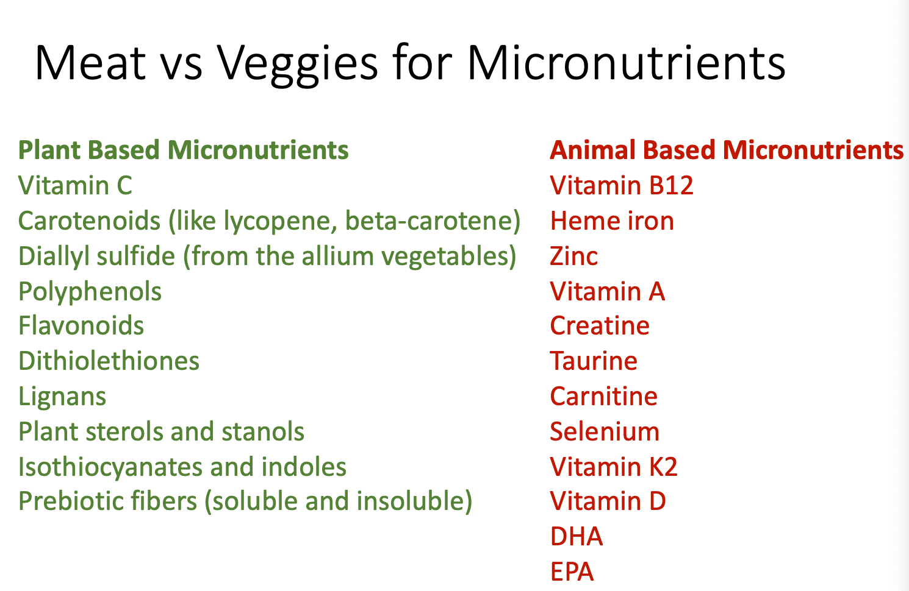

## Intro
While metabolism is all about the processing of macronutrients, multiple micronutrients are involved at nearly all enzymatic reactions along the way. This lecture will teach you the difference between vitamins and minerals, discuss what deficiency looks like for each of them, and provide food sources that can help you obtain each micronutrient.

We'll also cover a few studies showing how low vitamin/mineral intake can affect athletic performance AND whether it's best to get these important cofactors from real food or if supplements get the job done.

Finally we'll cover a critical study that examined which foods are richest in micronutrients overall. Using that list, you can easily decide how to combine various foods to cover all your needs.

## Key Take aways
At the end of this lecture, you should be able to:

- Separate the fat soluble and water soluble vitamins
- Understand at a high level, how vitamins, and especially B vitamins, are connected to metabolic processes
- Classify minerals, and know which ones are deficient across western populations eating western diets.
- Relay how having deficiencies in minerals/elements can impact athletic performance
- Define which foods are likely to provide the best "return on investment" for micronutrients  

## Key Terms
Key terms we will cover:

- [[Vitamins]]
- [[Minerals]]
- [[Fat soluble]]
- [[Water soluble]]
- Vitamin A, D, E, K
- [[B vitamins]] (names and numbers)
- [[Minerals]]/Elements: [[iodine]], [[magnesium]], [[manganese]], [[iron]], [[copper]], [[calcium]], [[zinc]], [[selenium]] 

## Vitamins & Minerals

- Vitamins are organic compounds made by plants and animals which are able to be broken down by heat or acid or air
- Minerals are inorganic, found in soil or water and cannot be broken down
- Different ratios of micronutrients are found in different foods

## Vitamins
- Vitamins are classified as either
fat-soluble or water-soluble 
  - Fat soluble: A, D, E and K
  - Water soluble: B and C

### Fat Soluble Vitamins
- [[Vitamin A]]: Required for proper vision and organ function
- [[Vitamin D]]: Required for immune function, calcium absorption and bone growth

Sheep have Vitamin D that is produced in their wool. Animals get their Vitamin D from their fur.

- [[Vitamin E]]: Antioxidant that protects cells from damage
- [[Vitamin K]]: Required for blood clotting and bone development

### [[Thiamin]] (B1)
- A major cofactor for a number of enzymes involved in oxidation
  - Conversion of pyruvate to Acetyl-CoA
  - Critical several [[citric acid cycle]] steps
  - Branched chain amino acid dehydrogenase 
  - [[Pentose phosphate pathway]]
- Deficiency is rare in developed countries, but occurs where white rice is a huge component of nutrition
  - The “polishing” process removes [[thiamin]]

### [[Riboflavin]] (B2)
- The vitamin responsible for bright yellow pee with multivitamins
- Critical structure in the following processes
  - [[Citric Acid Cycle]]
  - Electron Transport Chain 
  - Fatty Acid Oxidation
  - Antioxidant Enzymes
- Found in eggs, organ meats, green veggies and fortified grain products

### [[Niacin]] (B3)
- Also called nicotinic acid and nicotinamide
- Required for production of NAD and NADP+
- Can be synthesized from Tryptophan
- ~200 enzymes require NAD or NADP+ 
  - Glycolysis
  - TCA cycle
  - Electron transport
  - Fatty acid oxidation
- Deficiency was common in early 1900’s when corn was THE staple crop

### [[Pantothenic Acid]] (B5)
- Critical enzyme in Coenzyme A... The central molecule in all of metabolism
- Also works as an “Acyl carrier protein” for fatty acid synthesis
- Mushrooms, nuts, beans, peas, lentils, animal meat and dairy

### Vitamin B6 ([[pyridoxine]], pyridoxal, and pyridoxamine)
- B6 is a cofactor for more than 100 enzymatic reactions 
  - Amino acid synthesis
  - Glycogen breakdown
  - Neurotransmitter formation
  - Heme synthesis (red blood cell biology)
- Deficiency can involve skin issues, anemia, convulsions and/or depression
- Supplementation used for morning sickness, carpal tunnel syndrome, and PMS
- Found in dairy, salmon, tuna, eggs, beef, organ meats, carrots, spinach, avocado and sweet potato

### [[Biotin]] (B7)
- Important cofactor for enzymes involves in fatty acid synthesis, gluconeogenesis, and amino acid breakdown
- Deficiency can be seen with skin rash, hair loss and neurological impairments
  - Can be caused by consuming raw eggs
    - Avidin in raw eggs binds and sequesters biotin
- Found in egg yolks, legumes, sunflower seeds, liver, sweet potatoes, mushrooms

### [[Folate]]/Folic Acid (B9)

- Critical for nucleic acid and amino acid metabolism, often called 1- carbon metabolism
- Folate deficiency is more common, and characterized medically by “megaloblastic anemia” or large immature red blood cells
- Oxygen is carried less efficiently, with the largest issue being for pregnant women, where the fetus can develop neural tube defects
- Folate is found in leafy green veggies, beans, and fortified cereals

### [[Cobalamin]] (B12)
- Unique in that it contains an element (Cobalt)
- Neither plants NOR animal can synthesize B12, instead its produced by bacteria either in animals or in the soil
- B12 is found bound to protein in food, and must be released in the stomach
- B12 is critical in methionine synthesis and preventing demyelination of neurons
- B12 deficiency results in a nearly identical anemia as folate deficiency
  - Tremors are also often seen even in mild deficiency
- Found in animal products, eggs, milk and milk products, fortified cereals

## [[Minerals]] / Elements
- Minerals/Elements that are essential for body functions that can’t be synthesized in the body
  - Macrominerals
  - Trace Minerals
  - Ultratrace Minerals

[[Vitamin D]], [[Vitamin E]], [[Magnesium]], [[Vitamin A]] are all typical suspects for being insufficient in our diet

- We’re not doing a great job at getting ALL the minerals we need into our diet

### Iodine
- Required for thyroid hormone synthesis

- T4 has 4 iodine molecules
- T3 has 3 iodine molecules

- High concentrations found in: - Sea water
  - Seaweed and seafood
  - Dairy products (added to cattle feeds) - Iodized salt
  - 1/2 teaspoon of iodized salt meets the RDA for iodine

### [[Magnesium]]
- Plays a role in over 300 enzymes in the body
  - Glycolysis & TCA cycle
  - Fatty acid oxidation
  - Nucleotide synthesis & DNA and RNA transcription
  - Muscle contraction
- Low levels of Mg2+ are associated with fatigue and weakness, numbness, tingling, muscle contractions and cramps, seizures, personality changes, abnormal heart rhythms
- Found in high levels of dark chocolate, avocados, nuts, legumes, seeds, whole grains, fatty fish, leafy greens and bananas

### [[Manganese]]
- Important cofactor used in the conversion of Superoxide to H2O2
- Critical in the process of gluconeogenesis
- Involved in the urea cycle
- Deficiencies are pretty rare
- Found in most nuts, legumes, seeds, tea, grains and leafy greens

### Additional Elements
- [[Iron]] and [[copper]] are both used in enzymatic reactions driving the citric acid cycle and electron transport chain, and are necessary for red blood cell function
- [[Calcium]] activates a series of reactions including fatty acid oxidation, is a mitochondrial carrier for ATP, and glucose stimulated insulin release
- [[Zinc]] is a critical co-factor for more than 100 enzymes, including energy release pathways
- [[Selenium]]: Important for thyroid health, reproduction and defense against oxidative damage

## Study Results of Vitamin depletion
**Review noted the importance of adequate intake of magnesium, zinc, chromium to ensure the capacity for increased energy expenditure and work performance.** Supplemental magnesium and zinc improved strength and muscle metabolism

Magnesium depletion resulted in increased energy needs and an adverse effect on cardiovascular function -- important for postmenopausal women

Low dietary zinc also appears to impact cardiovascular function during exercise

A double blind study demonstrated that a state of depletion of [[thiamin]], [[riboflavin]] and Vitamin B6 can be induced with 8 weeks by a diet composed of normal food products

Micronutrients: Dietary intake v. supplement use
  - nutrition and metabolism group.
Whole foods are more effective than supplements,.

In search of a Micronutrient Dense Diet

## Summary
- Micronutrients are necessary for the function of key enzymes involved in nearly all metabolic pathways
- Low levels of micronutrients can also impact athletic performance
- Diet is always the best place to acquire micronutrients, but supplementation does have value in the right context

[//begin]: # "Autogenerated link references for markdown compatibility"
[Vitamins]: vitamins "Vitamins"
[Minerals]: minerals "Minerals"
[B vitamins]: b-vitamins "B Vitamins"
[magnesium]: magnesium "magnesium"
[manganese]: manganese "Manganese"
[Vitamin K]: vitamin-k "Vitamin K"
[Pentose phosphate pathway]: pentose-phosphate-pathway "Pentose Phosphate Pathway"
[Manganese]: manganese "Manganese"
[//end]: # "Autogenerated link references"