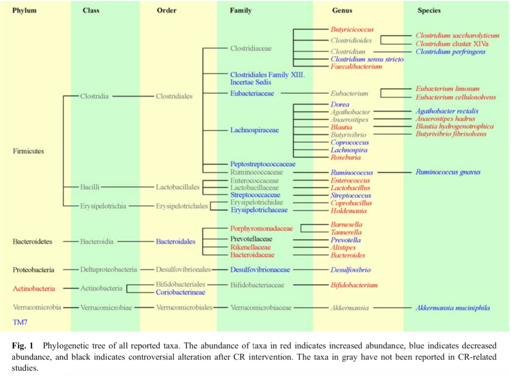
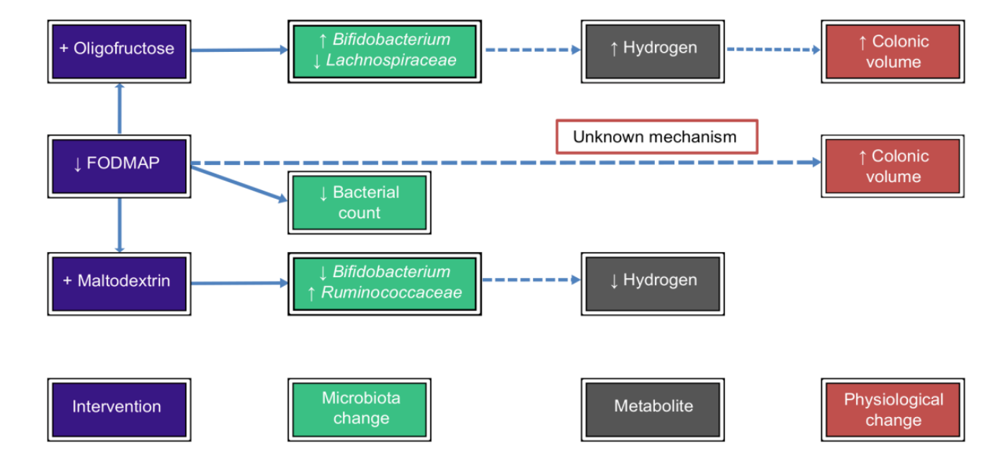
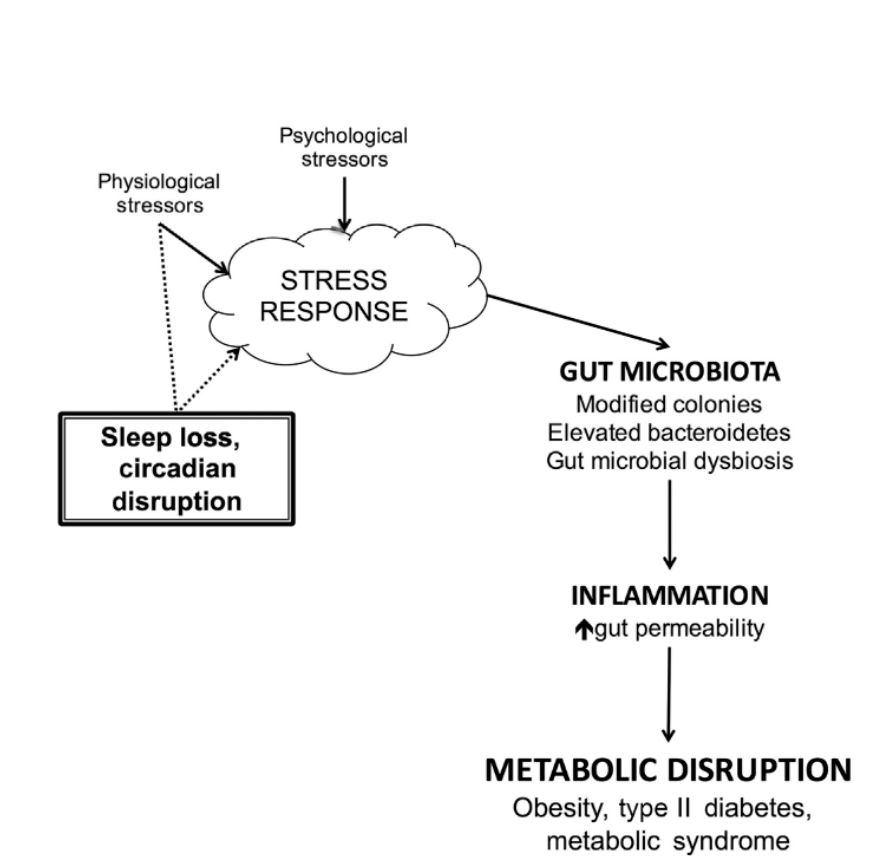

# Table of Contents

1.  [Key Take aways](#orgfd7e224)
2.  [Gut Biology Terms](#org78eb620)
3.  [Key Concepts](#orgb2b257b)
4.  [Diet](#org52c3cb7)
5.  [Calorie restriction](#org31a9293)
6.  [Ketogenic diet](#orgc85bfca)
7.  [Intermittent fasting](#org104ad67)
8.  [Gluten free diet](#orgcb61f3c)
9.  [low FODMAPs](#orgeef038c)
10. [Exercise](#org3ea6cfd)
    1.  [Correlative Studies](#orgc0a99ce)
    2.  [CAUSATIVE STUDIES](#org04a158a)
    3.  [ACUTE STUDIES](#org89882b2)
    4.  [performance-enhancing microbe](#orgee4f8ab)
11. [Sleep](#orgfdfc0a0)
    1.  [Acute Sleep Deprivation](#orgbdefb7a)
    2.  [Jet Lag](#org79fccfa)
        1.  [Mice](#org4de32ed)
        2.  [People](#orgacd0451)
12. [Summary so far](#org7531016)
13. [Probiotics](#org77d2d4a)
14. [VSL #3](#org00a144a)
    1.  [Prevent Fat Gain](#orgb835369)
15. [Prebiotics](#org90e1a71)
    1.  [Mechanism of Action](#orgedfb970)
    2.  [Prebiotic Rich Foods](#org6fed813)
16. [Artificial sweeteners](#org0dd2b1a)
17. [Emulsifiers](#orgcbe4e87)
18. [Summary](#orgaf21843)

# Key Take aways

At the end of this lecture, you should be able to:

-   Understand the pros and cons of common diets with regards to the microbiome
-   Explain the negative consequences of sleep disruption on the microbiome
-   Understand how exercise acutely modifies the microbiome
-   Understand how microbial composition may impact athletic performance through lactate biology
-   Explain the differences between probiotics and prebiotics
-   Know what diseases probiotics have been shown to have efficacy in and the potential mechanisms that are associated with those outcomes
-   Name common foods that are rich in prebiotics
-   Explain how artificial sweeteners may impact the microbiome
-   Explain how dietary emulsifiers impact the microbiome, inducing obesity

# [[Gut Biology Key Terms]]

- [[Calorie restriction]]
- [[Ketogenic diet]]
- [[Intermittent fasting]]
- [[Gluten free diet]]
- [[FODMAPs]]
- [[Jet lag]]
- [[Probiotics]]
- [[VSL]] #3
- [[Prebiotic]]
- [[Inulin]]
- [[Artificial sweeteners]]
- [[Emulsifiers]]

# Key Concepts

-   Lifestyle changes can influence the composition of the microbiome
    -   Diet
    -   Exercise
    -   Sleep

Change will only occur after a continued time of a lifestyle change. acute changes won&rsquo;t affect much

-   Certain supplements have shown clinical benefit in modulating the microbiome as well
    -   [[Probiotics]]
        -   [[Prebiotics]]

# Diet

-   Diet is thought to cause over 50% of the variation in microbial diversity in humans
    -   By comparison, twin studies teach us that genetics only controls about 8% of your microbiome

-   Dramatic dietary changes have been shown to alter the microbiome, but the effects are transitory unless the intervention is continued
    
    Need to continue with these changes for them to actually help you

-   We will explore the changes induced by many common diets

• Caloric Restriction
• Ketogenic Diet
• Intermittent Fasting • Gluten Free
• Low FODMAP diet

# [[Calorie restriction]]

Anti-inflammatory and butyrate producing microbes increased in abundance, whereas proinflammatory strains decreased

blue is decreased
red is increase

Individuals with a high baseline abundance of A. muciniphila before CR showed improved glucose homeostasis, blood lipids, and body composition

# [[Ketogenic diet]]

-   Keto increased the amount of A. muciniphila and Lactobacillus (a good thing) but at the severe expense of total microbiota diversity (a bad thing)

we want as many different strains of bacteria in our body

-   A different study indicated Keto reduced Bifidobacterium in the colon and plasma levels of SCFA

# [[Intermittent fasting]]

-   Mouse studies indicates that every other day fasting induces a microbiome that improves obesity, beige fat development and reduce inflammation
    -   The effect is transplantable into other mice indicating a causative relationship
    -   Fasting increases the production of SCFAs and lactate
-   Fasting improved pathogenic bacterial clearance in a Salmonella model
    -   Increased IgA production
-   Fasting also increased IgA levels in the ileum during intense stress episodes
    
    one day of fasting for a mouse would be 3-4 days for a human
    
    IF as we see it is a much shorter fast..

# [[Gluten free diet]]

-   Celiac patients have a unique microbiome enriched for E.coli and Staphylococcus, with overall reduced microbial diversity
    
    Pro-inflamatory
-   A second study indicated reductions in Lactobacillus and Bifidobacterium in people with Celiac
    -   In both cases, treatment with a GFD restored some, but not all, of the components of a “normal” microbiota
-   Healthy people on a GFD also see changes in their microbes
    
    elmination of gluten as a fuel source changes the microbiom

# low [[FODMAPs]]

-   Fermentable oligo-, di-, mono-saccharides and polyols have been implicated in exacerbating intestinal symptoms due to poor digestion
    
    short chains of sugars
    
    reduces total volume of bacteria in your gut
-   A Low FODMAP diet reduces the total volume of bacteria in the gut
    -   Some concern over the reduction of Bifidobacterium
    -   However, an increase in butyrate producing bacteria was also observed
        

# Exercise

## Correlative Studies

-   People that exercise tend to have higher levels of healthy associated bacteria such as A. muciniphilia and higher overall microbial diversity

-   Active individuals tend to have higher levels of SCFAs, but whether this is an effect of lifestyle/diet remains unclear

-   The microbiome of active individuals/athletes may produce metabolites that improve tissue repair, increase energy intake, and improve carbohydrate utilization
    
    Down stream effect of better utilizing carbs which makes for eating more

## CAUSATIVE STUDIES

-   Animal studies indicate that exercise induces
    -   An increase in butyrate producing bacteria
    -   An improvement in the Firmicutes/Bacteroidetes ratio

## ACUTE STUDIES

-   Long distance running induces changes, but relevance isn’t well understood
-   One exception is the clear upregulation of Veillonella across multiple modalities, which is involved in lactate metabolism

## performance-enhancing microbe

-   Veillonella uses lactate as a sole carbon source
-   Exercise induces every gut gene involved in metabolizing lactate to propionate
    
    -   The lactate is crossing over into the gut lumen
    
    The bacteria allows the draining of lactate that allows for more work to be done
-   Instillation of propionate into the large intestine recapitulates the improvement in run time
    -   The reduction of lactate in the blood by Veillonella is the beneficial effect

Very young field of study

# Sleep

-   Shift work is associated with:

• Type 2 diabetes
• Obesity
• Metabolic Syndrome
• Cancer
• Lack of Sleep

## Acute Sleep Deprivation

-   9 males underwent two nights of either:
    • Normal sleep (7-9 hours)
    • Partial sleep deprivation (4.25 hours)
-   Significant changes in microbiome
    -   Change in the F:B ratio which is so critical for obesity
        
        Got more F&rsquo;s and less B&rsquo;s

-   Stress is known to induce dysbiosis, reduce barrier functon, etc.
-   Lack of sleep is a well known stressor
-   As such, lack of sleep can lead to dysbiosis

## Jet Lag

### Mice

-   Mice eat more during the nocturnal phase and have a higher # of Clostridiales and Odoribacter
    -   This leads to energy metabolism, DNA repair, cell division, etc

-   During the light phase, more Lactobacillus is around
    -   This leads to more detoxification and gut motility

Transfered microbiome to other mice and those mice showed same obesity traits

### People

-   Loss of the bacterial circadian rhythm through transcontinental travel leads to dysbiosis
-   This dysbiosis leads to blood glucose issues and obesity when transferred into mice

# Summary so far

-   To generate a healthy microbiome
    -   Eat a high fiber diet continuously, including resistant starch rich foods
-   Exercise
-   Sleep within the appropriate circadian rhythm

# [[Probiotics]]

-   Defined as “live microorganisms which, when administered in adequate amounts, confer a health benefit on the host”
-   Most clinical evidence is inconsistent due to poor study design, variability in strains used and delivery methods
-   The most consistent evidence supports use for:
    -   Infectious and antibiotic driven diarrhea
    -   Insulin resistance in diabetes
    -   Remission of IBD
-   Consistent long term benefit is controversial
    -   The major issue is lack of a “niche” to colonize

# [[VSL]] #3

-   Well studied, ultra high potency probiotic
-   Biological effects in:
    -   Fat gain
    -   [[Leaky gut]] in HIV
    -   IBD/IBS/Pouchitis
-   Clinically shown to reduce inflammation
-   Induces anti-microbial peptide production
-   Bacteria in VSL#3 are known to improve:
    -   [[Epithelial]] cell tight junction integrity
    -   Increase anti-inflammatory bacteria and reduce space for fungi, etc
    -   Increase anti-microbial protein production
    -   Reduce inflammation through decreased cell recruitment, inhibiting NFkB
        
        NFkB - one of the most pro-inflamatory pathways

## Prevent Fat Gain

-   Mouse models show that VSL#3 could prevent obesity and diabetes
    -   Promotes the release of GLP-1 (very beneficial blood sugar protein)
    -   Increased SCFA production

-   +1000 cal/day excess of food
-   Analyzed the impact of VSL#3
-   Hypothesis is that the microbial shift driven by high fat leads to excess systemic inflammation (“metabolic endotoxemia”) which contributes to the fat gain
-   VSL#3 prevented fat mass gain compared to placebo
-   VSL#3 resulted in heightened levels of several probiotic strains
-   No change in systemic inflammation was observed

# [[Prebiotic]]s

-   Prebiotics are ”fertilizer” for the bacteria that already exist in your gut
-   “Selectively fermented ingredients that allow specific changes, both in the composition and/or activity of the gastrointestinal microflora that confers benefits upon host wellbeing and health”
-   The goal is to have the “good” bacteria grow on the prebiotics, but not the deleterious bacteria
-   Many preclinical studies with good efficacy for multiple indications
-   Human studies are less robust, but several still exist

## Mechanism of Action
Prebiotic effect 
 Mechanisms/expected results

Changing in the composition and population of gut microflora
  - Selectively stimulating beneficial members of the gut microflora with immunomodulatory activity (such as bifidobacteria and lactobacilli)
  - Inhibiting epithelial adhesion and invasion of pathogenic microbes

Increasing production of fermentation products by gut microflora 
  - Increasing production of SCFAs, vitamins, bacteriocins and other antimicrobial compounds. Butyrate, propionate, acetate and pyruvate are able to beneficially change the expression of cytokines and improve immunity

Simulating intestinal barrier function
  - Improving intestinal permeability
  - Increasing production of mucus

Direct stimulation of immune system
 - Improving intestinal permeabilit
 - Increasing production of mucus
 - Increasing anti-inflammatory cytokines
 - Decreasing proinflammatory cytokines
 - Beneficial effects on GALT and mucosal immune system
 - Increasing the mucosal Ig, altering cytokine and lymphocyte expression, increasing the secretory IgA

Improving nutrients absorption
 - Improving small intestine development
 - Increasing villi height, crypt depth and number of goblet cells per villus

## Prebiotic Rich Foods

• Chicory
• Bananas
• Onions
• Leeks
• Artichokes
• Asparagus
• Garlic
• Dandelion Greens
• Oats
• Jerusalem Artichoke • Apples
• Burdock Root
• Konjac Root
• Jicama
• Seaweed

# [[Artificial sweeteners]]

-   Low dose aspartame increased Enterobacteria and increased ratios of Firmicutes
    
    Proinflamitory bacteria
-   Mice feed sucralose had worse blood sugar control than mice fed sugar, an effect that could be transplanted into additional mice through the microbiome

-   Rats given Splenda had reduced bacterial diversity
-   Human studies are lacking however, a small study showed that healthy volunteers who switched to artificial sweeteners had worse blood glucose control than prior
-   In general, fake sugars seem to induce elevated inflammation

# [[Emulsifiers]]

-   Often used in processed foods to improve ingredient mixing
    -   For example lecithin, guar gum, and about 20 other chemicals
        
        [[Bile]] is a natural emulsifier that the gut produces
        Emulsifiers get in your gut mucas layer and take it away
-   The thought is that these emulsifiers can break down or mix the mucus layer with the microbial products that are supposed to be kept away from the host tissue
-   Mice on emulsifiers gained more weight, ate more food and had worse blood glucose
-   This effect is ablated in germ free mice

# Summary

-   To generate a healthy microbiome
    -   Eat a high fiber diet continuously, including resistant starch rich foods
-   Exercise
-   Sleep within the appropriate circadian rhythm
-   Potentially add in a high quality, tested probiotic
-   Eat prebiotic rich foods
-   Generally avoid artificial sweeteners
-   Generally avoid dietary emulsifiers

