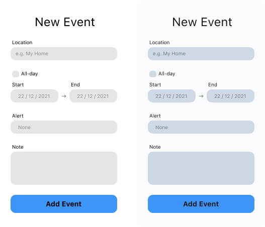

I used the primary [[call to action]] as the main hue and derived all the other colors from that. In this case the hue is `214` on the [[HSB]] color wheel. Brings a warmth and richness that the desaturated grays don't.

Use low saturation for your [[structural colors]].

