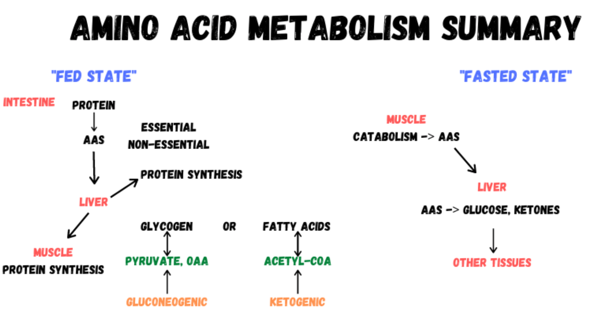

This lecture will review all the ways in which proteins are taken in, stored, and metabolized within the human body.

We will start off with a review of the different ways that protein structures are formed, looking at primary, secondary and tertiary structures. Of note, we'll talk about the ways that amino acids (building blocks of protein) can be categorized.

We follow that with an overview of the digestive system and how proteins are broken down and then absorbed through the epithelial lining into the body. We will explore the organs and enzymes involved in that process. Once inside the body, we will explore how the body puts amino acids together through the use of the DNA>RNA>Protein chain of action.

Next, we will review how the body can convert amino acids into other substances for the creation of new energy. Specifically, we'll cover the glucogenic and ketogenic amino acids.

We will cover the urea cycle and how it is critical to prevent the accumulation of ammonia, a toxic chemical released by the metabolism of amino acids.

Finally, we will put all of these concepts together to think about the fate of protein/amino acids in the fed and fasted state.

At the end of this lecture, you should be able to:

- Explain protein digestion into amino acids
- Understand where amino acids travel to once inside the body
- Describe protein synthesis
- Recognize how amino acids can be converted into other metabolites for metabolism into cellular energy
- Explain the urea cycle's importance
- Explain the various fates of protein in the fed or fasted state

## [[Metabolism Key Terms]]
[[Amino acid]]
Essential versus non-essential amino acids
Primary, secondary and tertiary protein structure
[[DNA]]
[[RNA]]
[[Protein synthesis]]
Glucogenic and ketogenic amino acids
Urea cycle
[[Ammonia]]

## Lecture goals

- Learn the basics of structure, digestion, uptake, metabolism and “storage” for protein
  It's different than carbs and fat!
- Understand the differences between essential and non-essential amino acids
- Identify glucogenic vs ketogenic amino acids
- Understand how amino acids turn into other macronutrients
- Understand the purpose of the [[urea cycle]]

## Protein structure
Essential amino acids cannot be synthesized within the body

Non-essential amino acids can be synthesized

Valine, Leucine, Isoleucine account for 30-40% of muscle tissue

### Peptide structures Secondary structure
The fold that proteins take when they group together

alpha-helix
beta-pleated sheet

### Tertiary & Quaternary Structure
Tertiary-
The sheets of individual secondary structures (peptides) that interact and fold on eachother.

Quaternary - aggregation of two or more peptides

## Protein Digestion and Absorption
- Occurs in the stomach and duodenum
- Pepsin secreted by the stomach, trypsin and chymotrypsin secreted by the
pancreas

key players here

- Break proteins down into shorter polypeptides
- Polypeptides are then broken down by various exopeptidases and dipeptidases into amino acids

peptidases

### Protein Digestion in the Stomach
- Protein is initially “denatured” in the stomach due to the acidic environment
An egg white turning white while being cooked is a form of 'denaturing' -- breaking down

- From there digestion begins through the action of an enzyme called pepsin

### Protein Digestion in the Small Intestine
- The breakdown of peptides to single amino acids continue in the small intestine
  
- Three major enzymes are involved 
  - Chymotrypsin
  - Trypsin
  - Carboxypeptidase

di- & tri peptides as well as individual amino acids can be transported across

### Protein Absorption in the Intestine

- A wide array of amino acid transporters are responsible for transporting amino acids across the epithelial border and into the blood stream
  
  one group that brings them into the cell, the other to bring the amino acids into your blood -- primarily going to your liver

- These processes are typically sodium dependent

## Protein metabolism
**What Fates do Amino Acids Have Inside The Body**
- New Protein Formation

1. Double-stranded DNA in the cell nucleus
   The master recipe on how to form proteins
2. Messenger RNA (mRNA) forming on DNA strands - starts assembling amino acids together
3. Formation of protein on ribosome
   The growing polypeptide chain eventually forms into a protein

### Recap
- DNA transcription to produce mRNA occurs in the nucleus
- The mRNA is then transported either into the cytoplasm or into the ER
- The mRNA is then translated to proteins through the sequential addition of amino acids in an assembly line like fashion

### Amino Acid Use in New Protein Synthesis in the Liver
- Liver is the first site of amino acid transport into the body
- The liver makes a TON of critical proteins
  - Albumin
  - Globulins(SHBG,TBG,CBG) 
  - Fibrinogen
  - Transferrin
  - Complement proteins
  - Clotting proteins

Not all amino acids are used for proteins

## Amino acids can fit nicely into pathways we already know
- Amino acids can be converted to various intermediates of glycolysis and the citric acid cycle, allowing them to enter cellular respiration through a variety of “side doors”
  Some easily convert to pyruvate and others to acetyl-CoA
- Once in the respiration pathway, they’ll simply go through the same pathways we learned for carbohydrates yielding NADH, FADH2 and ATP.

### Amino Acid use in [[Citric Acid Cycle]]

glucogenic amino acids can eventually be turned into glucose.
Ketogenic amino acids can be converted into ketones. (Acetoacetyl-CoA, Acetyl-CoA)

- Amino acids may be used to provide metabolic energy in the well-fed state when amino acid intake exceeds protein synthesis requirement
- They will also be used in the “starved” state from endogenous protein sources (more on that later)
- Not ALL amino acids enter into the same place in the cycle
- The entrance of the amino acids at different points defines their classification as “glucogenic” or “ketogenic”

- Gluconeogenic amino acids can become glucose
- Ketogenic amino acids can become ketones
- Several can do BOTH
- As such, protein can absolutely be converted into glucose and stored as either glycogen OR fatty acids and stored as fat
  - Does require a good bit of ATP to make happen

protein can be stored as carbs or fatty acids.

## [[The Urea Cycle]]

- When amino acids enter the cellular respiration pathway, they must first have their amino group removed
- This step makes ammonia (NH3) as a waste product to the CNS
- Ammonia is a fairly toxic chemical and is converted to
urea before removal from the body as urine
- Blood UREA nitrogen is something you will encounter on a blood chemistry report
- The levels can tell you about the protein intake levels, but also about general kidney and liver health as well

BUN - measure of how much [[The Urea Cycle]] is being run.

## Protein Breakdown / Catabolism

Muscle protein Synthesis 
 1. Food: Combined Essential Amino Acids + Insulin Response
 2. Exercise (Secondary Response)
Muscle protein Breakdown
  1. Starvation
  2. Stress
  3. Injury/Illness
  4. Exercise (immediate response)

- Occurs in the fasted state
- Protein is broken down into amino
acids, then transported to the liver
- Gluconeogenesis only happens in kidney & liver

## Summary

- Protein digestion occurs in the stomach & small intestine
- Amino acids are transported to the liver
- From there, amino acids have a number of different fates
  - Protein synthesis in the liver
  - Shipment to additional tissue for protein synthesis
  - Use in the citric acid cycle
  - Gluconeogenic amino acids converted to glucose
  - Ketogenic amino acids converted to ketones
  - Storage as glycogen or as fatty acids
- During starvation, muscle catabolism generates free amino acids
- The urea cycle is needed to dispose of ammonia, a toxic compound

[//begin]: # "Autogenerated link references for markdown compatibility"
[Metabolism Key Terms]: metabolism-key-terms "Metabolism Key Terms"
[//end]: # "Autogenerated link references"